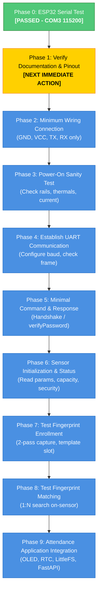

# R307S Fingerprint Sensor Integration Plan

**Document:** `docs/r307s-integration-plan.md`  
**Status:** PREPARATION ONLY — NOT YET ELECTRICALLY CONNECTED OR POWERED  
**Date:** 2026-10-01  
**Target Hardware:** ESP32-WROOM-32 DevKit V1 + R307S Optical Fingerprint Sensor  

---

## 1. Executive Summary

This document establishes the authoritative, phased engineering plan for integrating the **R307S optical fingerprint sensor** into the Biometric Attendance System.

> [!CAUTION]
> **ELECTRICAL SAFETY & HARDWARE BOUNDARY:**
> - The R307S module has **NOT** been electrically connected or powered.
> - The pinout and voltage specifications are **UNVERIFIED — HARDWARE VERIFICATION REQUIRED**.
> - Observed wire colors on the harness must **NEVER** be assumed to indicate signal functions.
> - Connecting 5V logic to an ESP32 3.3V GPIO will cause **permanent silicon destruction**.
> - Do not skip ahead in the test sequence. Follow each phase gate strictly.

---

## 2. Fact Categorization

### A. VERIFIED FACTS (Confirmed by Bench Testing or Direct Observation)
1. **Microcontroller Platform:** ESP32-WROOM-32 DevKit V1.
2. **Host Connection:** ESP32 USB serial communication is confirmed functional on **COM3**.
3. **Firmware Environment:** PlatformIO Core 6.2.0 + Arduino framework for ESP32 (`espressif32@6.5.0`) compiles and links cleanly.
4. **Validation Firmware Upload:** Baseline toolchain test sketch was successfully compiled, flashed to the ESP32 over COM3, and verified emitting serial telemetry at 115200 baud (**Phase 0 PASSED**).
5. **Physical Harness Inspection:** The acquired R307S module came with a 6-wire ribbon harness with the following physical wire order:
   - **Position 1:** Red
   - **Position 2:** Black
   - **Position 3:** Yellow
   - **Position 4:** Green
   - **Position 5:** Blue
   - **Position 6:** White
6. **Physical State:** The R307S is currently disconnected on the workbench with zero electrical power applied.

---

### B. INFORMATION THAT STILL NEEDS TO BE VERIFIED (UNVERIFIED)
1. **Harness Pin Mapping:** Does Position 1 (Red) correspond to VCC, or is Position 1 something else? Wire colors vary widely across batch suppliers and clone factories.
2. **Module Silkscreen / PCB Labels:** Does the PCB underside or connector housing have laser-etched or silkscreened pin labels (e.g., `VCC`, `GND`, `TX`, `RX`, `TOUCH`, `3.3V`)?
3. **Supply Voltage Requirements ($V_{CC}$):** 
   - Standard R307/R307S modules typically specify DC 4.2V – 6.0V on their primary power rail (using an internal 3.3V LDO).
   - Some specialized R307S revisions accept a regulated 3.3V input.
   - Supplying 3.3V to a 5V LDO input may result in brownout and optical sensor failure. Supplying 5V to a 3.3V-direct rail will burn the sensor DSP.
4. **UART Logic Voltage Levels:**
   - Are the `TXD` output and `RXD` input signals 3.3V TTL or 5V TTL?
   - The ESP32 inputs are strictly 3.3V tolerant. If the R307S drives TXD at 5V, a resistor divider or bidirectional logic level shifter is mandatory.
5. **Default Factory Baud Rate:** Typically 57600 baud (8-N-1), but some firmware builds use 9600 or 115200 baud.
6. **Default Device Address & Password:** Typically address `0xFFFFFFFF` and password `0x00000000` (standard Synochip / Grow protocol).
7. **Template Capacity:** Documented as 1,000 templates for R307S, to be confirmed via parameter query packet.
8. **Peak Current Draw during Optical Capture:** The optical illumination LED and DSP surge current (typically 50–120 mA). Must ensure the ESP32 dev board USB regulator or external rail can supply this without resetting the MCU.

---

### C. PROPOSED DESIGN DECISIONS (Pending Verification Gates)
1. **ESP32 UART Pin Allocation:**
   - Propose using ESP32 Hardware UART2.
   - Default GPIOs: **GPIO 16 (RX2)** and **GPIO 17 (TX2)** via the ESP32 GPIO matrix.
   - Note: GPIO 16/17 are available on WROOM-32 DevKit boards (verify they are not tied to PSRAM).
2. **Software Abstraction Layer:**
   - Abstract the fingerprint driver behind a dedicated interface (`firmware/include/fingerprint_sensor.h`).
   - Keep `main.cpp` as an application state machine coordinator, preventing vendor protocol code from tangling with networking, database sync, and OLED rendering.
3. **Library Selection:**
   - Adafruit Fingerprint Sensor Library (`adafruit/Adafruit Fingerprint Sensor Library @ 2.1.3`) is currently pinned in `platformio.ini`. The R307S uses the standard ZFM / Synochip packet format, which this library supports. Protocol compatibility will be verified during Phase 5.
4. **Non-Blocking Operation:**
   - Fingerprint acquisition must not block FreeRTOS networking tasks. UART communication will use bounded timeouts (≤ 1000 ms).

---

## 3. Harness Observation & Physical Inspection Guide

```
+-------------------------------------------------------------+
|                  R307S OPTICAL MODULE                       |
|                                                             |
|           +----------------------------------+              |
|           |   [1] [2] [3] [4] [5] [6]        |              |
|           +----------------------------------+              |
|             |   |   |   |   |   |                           |
|             |   |   |   |   |   +-- Pos 6: White            |
|             |   |   |   |   +------ Pos 5: Blue             |
|             |   |   |   +---------- Pos 4: Green            |
|             |   |   +-------------- Pos 3: Yellow           |
|             |   +------------------ Pos 2: Black            |
|             +---------------------- Pos 1: Red              |
+-------------------------------------------------------------+
```

### Critical Rules for Harness Verification
1. **Do not trust red as +5V or black as GND:** In many low-cost Chinese cable assemblies, wire ribbons are inserted in arbitrary reverse or arbitrary color orders.
2. **Perform Continuity / Silkscreen Check:**
   - Remove the module casing screws if necessary, or inspect the PCB connector with a magnifying glass / microscope.
   - Trace GND to the ground plane or metal casing shield with a multimeter in continuity mode.
   - Locate the onboard LDO regulator (often an SOT-23 marked 662K for 3.3V) to verify the input supply pin.

---

## 4. 10-Phase Hardware Integration Sequence



### Detailed Phase Definitions

#### Phase 0: ESP32 Baseline Verification — STATUS: PASSED
- **Objective:** Verify microcontroller boots, PlatformIO toolchain builds, and serial monitor communicates.
- **Evidence:** Compiled `firmware/src/main.cpp`, uploaded via PlatformIO to COM3, verified serial monitor at 115200 baud showing chip model and heap.

#### Phase 1: R307S Documentation & Physical Pinout Verification — STATUS: IN PROGRESS / BLOCKED ON HUMAN BENCH INSPECTION
- **Objective:** Establish authoritative pin assignment and electrical ratings from physical markings or official datasheet.
- **Required Actions:**
  1. Inspect module connector pins for numbers (1–6) or silkscreen labels (`VCC`, `GND`, `TXD`, `RXD`, `TOUCH`, `3.3V`).
  2. Use multimeter continuity to verify which pin connects to the ground plane or shield.
  3. Determine whether power input is 5V (typical) or 3.3V.
  4. Record the definitive pinout table in `hardware/pinout.md`.
- **Pass Criteria:** Pinout and supply voltage documented with zero ambiguity.

#### Phase 2: Minimum Wiring Connection
- **Objective:** Wire only the 4 essential lines between ESP32 and R307S.
- **Required Actions:**
  - Common Ground: ESP32 GND ↔ R307S GND.
  - Power: ESP32 VIN (5V) ↔ R307S VCC (if 5V verified) OR ESP32 3V3 ↔ R307S VCC (if 3.3V verified).
  - ESP32 RX (GPIO 16) ↔ R307S TXD.
  - ESP32 TX (GPIO 17) ↔ R307S RXD.
  - Leave Touch (Pin 5) and auxiliary pins unconnected.
- **Pass Criteria:** Breadboard wiring matches verified pinout; no loose wires or short circuits.

#### Phase 3: Power-On Sanity Test
- **Objective:** Ensure safe electrical operation without damaging components.
- **Required Actions:**
  1. Connect ESP32 to USB with multimeter monitoring the 5V and 3.3V rails.
  2. Check for abnormal voltage drop (< 4.5V on 5V rail or < 3.2V on 3.3V rail).
  3. Check temperature of ESP32 and R307S with finger touch (must remain room temperature).
  4. Measure R307S TX pin voltage relative to GND with multimeter. **Must be ≤ 3.3V.** If it reads ~5V, disconnect immediately and install a logic level shifter.
- **Pass Criteria:** Voltages within tolerance, zero component heating, TX level ≤ 3.3V.

#### Phase 4: Establish UART Communication
- **Objective:** Verify serial data link between ESP32 and R307S.
- **Required Actions:**
  - Initialize ESP32 `HardwareSerial(2)` on GPIO 16 (RX) and GPIO 17 (TX) at 57600 baud.
  - Listen for boot packets or transmit probe bytes.
  - Test alternative baud rates (9600, 19200, 38400, 115200) if 57600 fails.
- **Pass Criteria:** Valid serial frames received without UART framing errors.

#### Phase 5: Minimal Command & Response
- **Objective:** Send a standardized Synochip command packet and receive a valid acknowledge packet.
- **Required Actions:**
  - Transmit `verifyPassword` command packet (`0x13` with password `0x00000000`).
  - Expect response packet with confirmation code `0x00` (OK).
- **Pass Criteria:** Sensor returns acknowledge packet with confirmation code `0x00`.

#### Phase 6: Sensor Initialization & Status Query
- **Objective:** Query module hardware parameters.
- **Required Actions:**
  - Send `readSysPara` command (`0x0F`).
  - Parse and display: status register, system identifier, library capacity, security level, device address, data packet size, and baud rate setting.
- **Pass Criteria:** System parameters printed to serial console matching R307S specification.

#### Phase 7: Biometric Enrollment Test
- **Objective:** Enroll a test fingerprint into module flash memory.
- **Required Actions:**
  - Step 1: Prompt finger placement, send `getImage` (`0x01`).
  - Step 2: Convert to character buffer 1 with `image2Tz` (`0x02`, buffer 1).
  - Step 3: Prompt finger removal and replacement, capture image 2 (`0x01`).
  - Step 4: Convert to character buffer 2 with `image2Tz` (`0x02`, buffer 2).
  - Step 5: Merge buffers into template with `createModel` (`0x05`).
  - Step 6: Store template in slot 1 with `storeModel` (`0x06`, slot 1).
- **Pass Criteria:** Template successfully written to slot 1 with confirmation code `0x00`.

#### Phase 8: Biometric Matching Test
- **Objective:** Verify 1:N fingerprint search and identification.
- **Required Actions:**
  - Place enrolled finger: capture image, convert to buffer 1, execute `fingerSearch` (`0x04`).
  - Verify returned slot ID equals 1 and confidence score exceeds match threshold (> 50).
  - Place un-enrolled finger: verify sensor returns `FINGERPRINT_NOTFOUND` (`0x09`).
- **Pass Criteria:** Enrolled finger matches slot 1 reliably; un-enrolled finger rejected reliably.

#### Phase 9: Attendance Application Integration
- **Objective:** Connect verified driver into full system pipeline.
- **Required Actions:**
  - Connect matched slot ID to student identity lookup in SQLite via FastAPI.
  - Update OLED display with student name and real-time clock timestamp from DS3231.
  - Trigger green LED and audio chime on match; red LED on reject.
  - Queue attendance event to LittleFS if offline; POST to `/api/v1/attendance` if online.
- **Pass Criteria:** End-to-end attendance scan updates web dashboard in < 1.5 seconds.

---

## 5. Failure & Debugging Strategy

| Symptom | Probable Cause | Diagnostic / Resolution Step |
| :--- | :--- | :--- |
| **No response from sensor (Timeout)** | RX/TX lines reversed | Swap GPIO 16 (RX) and GPIO 17 (TX) connections. |
| **Sensor LED ring does not light up** | Power not connected or voltage too low | Verify VCC rail with multimeter; confirm 5V/3.3V selection. |
| **Garbage characters received** | Baud rate mismatch | Iterate baud rates: 57600 (default) → 9600 → 115200 → 38400. |
| **Sensor warms up or draws > 200mA** | Incorrect pinout / short circuit | **POWER OFF IMMEDIATELY.** Re-verify pin 1 vs pin 6 orientation. |
| **ESP32 resets when finger placed** | Brownout caused by optical LED surge | Add 100µF electrolytic capacitor across 5V and GND near sensor. |
| **Communication fails on GPIO 16/17** | PSRAM conflict on board | Remap UART2 to alternative GPIOs (e.g., GPIO 25/26 or 27/14) via GPIO matrix. |

---

## 6. Pre-Connection Human Verification Checklist

Before connecting any wire to the ESP32:
- [ ] Physical module inspected for silkscreen labels or pin 1 indicator.
- [ ] Multimeter continuity check performed to identify ground pin.
- [ ] Voltage requirement confirmed (5V vs 3.3V).
- [ ] Harness wire color order documented and cross-referenced with pin numbers.
- [ ] ESP32 disconnected from USB power while breadboard wiring is assembled.
